<div align="center">

# 🏆 Top 5 Finalist — IEEE HackElite 2.0 (2025)


# EventTrix
### Mobile-First Tech News & Event Intelligence Platform

[](https://reactnative.dev/)
[](https://dotnet.microsoft.com/)
[](https://www.mongodb.com/)
[](https://jwt.io/)
[](https://developer.mozilla.org/en-US/docs/Web/API/WebSockets_API)

> **Recognized among the Top 5 projects** at IEEE HackElite 2.0 — a national-level competitive hackathon.
> EventTrix bridges the gap between IT professionals, students, and technology solution providers through real-time, curated tech intelligence.

</div>

---

## 📋 Table of Contents

- [Achievement](#-achievement)
- [Project Overview](#-project-overview)
- [System Architecture](#-system-architecture)
- [UI & Screenshots](#-ui--screenshots)
- [Key Features](#-key-features)
- [Security Implementation](#-security-implementation)
- [Tech Stack](#-tech-stack)
- [Project Structure](#-project-structure)
- [Getting Started](#-getting-started)
- [API Reference](#-api-reference)
- [What I Learned](#-what-i-learned)

---

## 🏆 Achievement

| Award | Event | Year |
|---|---|---|
| 🥇 **Top 5 Finalist** | IEEE HackElite 2.0 — National Hackathon | 2025 |

EventTrix was selected among the **Top 5 projects** out of a highly competitive pool at IEEE HackElite 2.0 — a nationally recognized hackathon organized by the IEEE Student Branch. The judging panel evaluated projects on **innovation, technical depth, real-world applicability, and system design**.

> **Why it stood out:** Full-stack architecture built under tight time constraints, featuring real-time WebSocket communication, role-based access control, and a production-grade mobile UI — all designed and implemented within the hackathon window.

---

## 🔍 Project Overview

**EventTrix** is a mobile-first platform that delivers curated technology news and event updates to students, IT professionals, and companies in real time.

The platform operates across **three user roles**:

| Role | Capabilities |
|---|---|
| **User** | Browse feed, subscribe to topics/companies, receive push notifications |
| **IT Solution Provider** | Publish news posts, manage categories, reach targeted subscribers |
| **Admin** | Manage users, content, and platform integrity |

**Core Problem Solved:** Professionals and students waste significant time sourcing relevant tech news across fragmented platforms. EventTrix centralizes this into a subscription-based, real-time feed — personalized to each user's interests.

---

## 🏗️ System Architecture

> Full system architecture designed and documented as part of the engineering process — illustrating the complete data flow from mobile client through the API layer to the database and external services.


### Architecture Breakdown

The system is structured across **three distinct layers**, each with clear responsibilities and boundaries:

**① Client Layer — React Native Mobile App**

The mobile application is built with React Native and runs via Expo Go on both Android and iOS. All API communication flows through Axios HTTP Client with a centralized request interceptor that automatically injects the JWT Bearer token on every authenticated request. A dedicated 401 handler catches expired token responses and forces re-authentication. The WebSocket client maintains a persistent WSS connection to the SignalR Hub for real-time feed updates and push notifications. Global authentication state (JWT token + user role) is managed via `AuthContext`, making auth state available across all screens without prop drilling.

**② Backend Layer — ASP.NET Web API (C#)**

The backend is a stateless RESTful API built on ASP.NET. Every incoming request passes through JWT Middleware which validates the token signature, checks expiration, and extracts the role claim before any controller logic executes. Controllers are organized by domain: Auth, Posts, Categories, Subscriptions, Notifications, and Admin. Business logic is delegated to dedicated Service classes keeping controllers thin and testable. The Real-Time Engine is powered by ASP.NET SignalR — when a Provider publishes a post, the Event Broadcaster identifies all active subscribers via the Connection Manager and pushes instant notifications through the SignalR Hub to connected WebSocket clients.

**③ Data Layer — MongoDB**

MongoDB stores six collections: Users, Posts, Categories, Subscriptions, Notifications, and Roles. The document model is a natural fit for the flexible, schema-variable nature of posts and subscriptions — different post types carry different metadata without requiring schema migrations.

### Key Architectural Decisions

| Decision | Rationale |
|---|---|
| **Stateless JWT auth** | Eliminates server-side session storage; backend scales horizontally without sticky sessions |
| **SignalR over raw WebSockets** | ASP.NET's abstraction handles connection lifecycle, reconnection, and group broadcasting cleanly |
| **MongoDB document model** | Flexible schema accommodates variable post/subscription structures without rigid relational joins |
| **Axios interceptors** | Centralized token injection and error handling — no repeated auth logic across service files |
| **bcrypt cost factor 12** | Balances security (computationally expensive for attackers) with login performance for users |

---

## 📱 UI & Screenshots

> Built mobile-first with React Native & Expo Go — optimized for Android and iOS.

<table>
  <tr>
    <td align="center"><b>Login Screen</b></td>
    <td align="center"><b>Registration</b></td>
    <td align="center"><b>Email Verification</b></td>
  </tr>
  <tr>
    <td>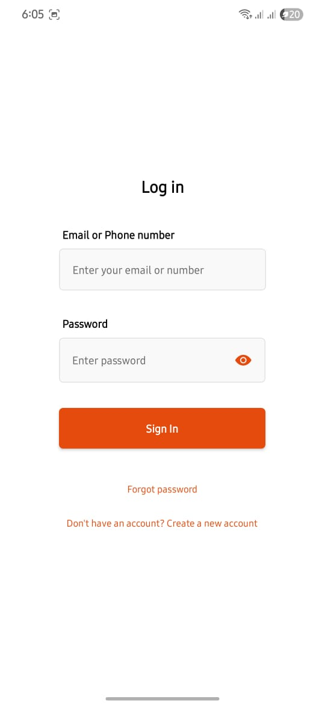</td>
    <td>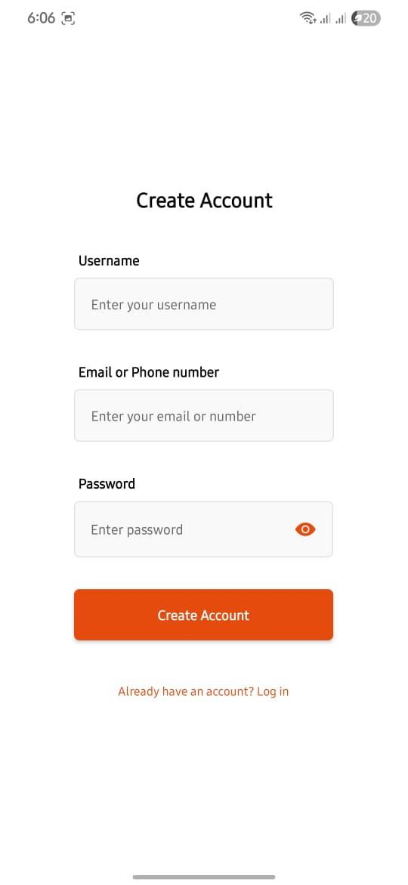</td>
    <td>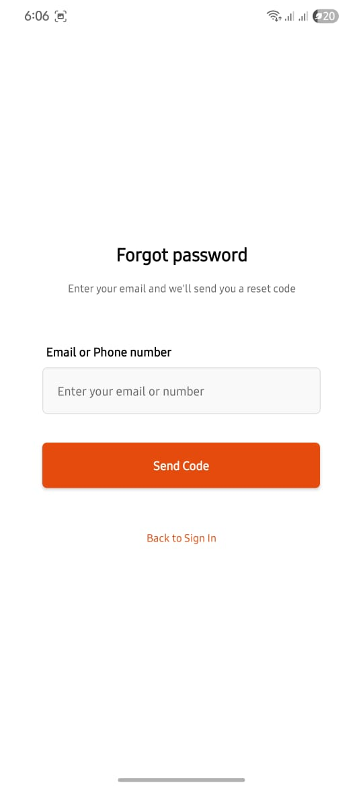</td>
  </tr>
  <tr>
    <td align="center"><b>News Feed</b></td>
    <td align="center"><b>Subscriptions</b></td>
    <td align="center"><b>Notifications</b></td>
  </tr>
  <tr>
    <td>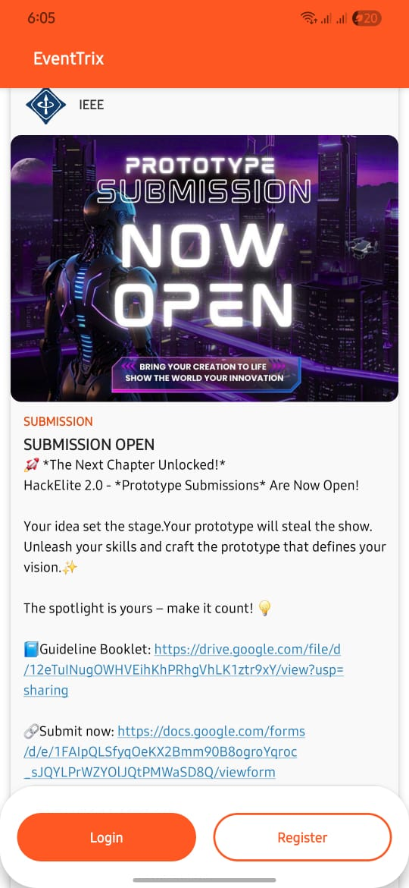</td>
    <td>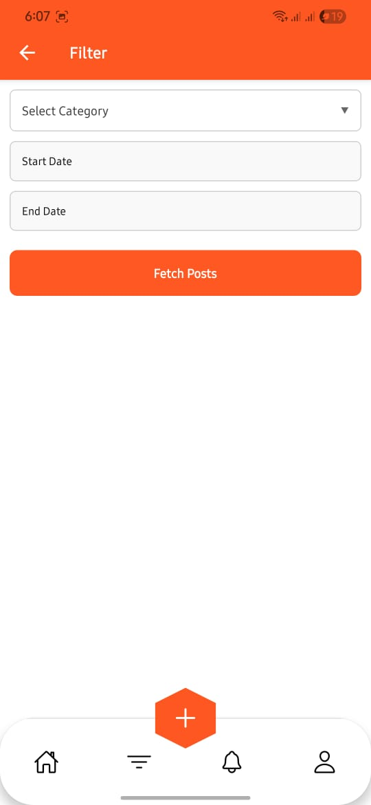</td>
    <td>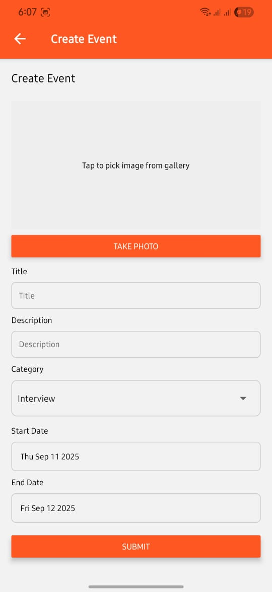</td>
  </tr>
  <tr>
    <td align="center"><b>Provider Dashboard</b></td>
    <td align="center"><b>Post Management</b></td>
    <td align="center"><b>User Settings</b></td>
  </tr>
  <tr>
    <td>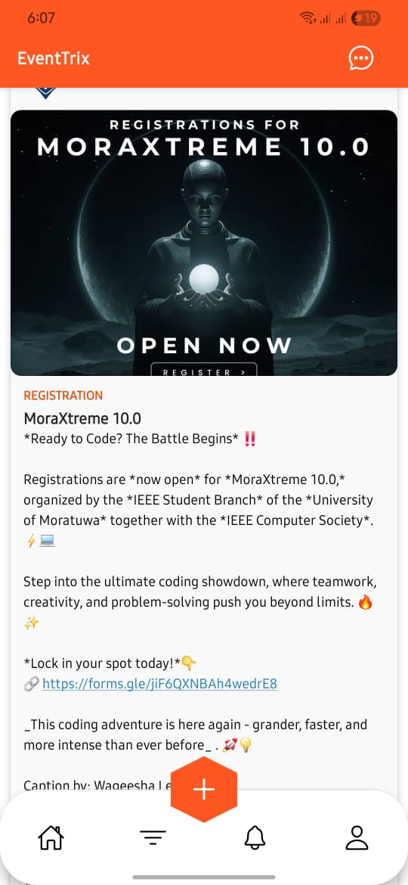</td>
    <td>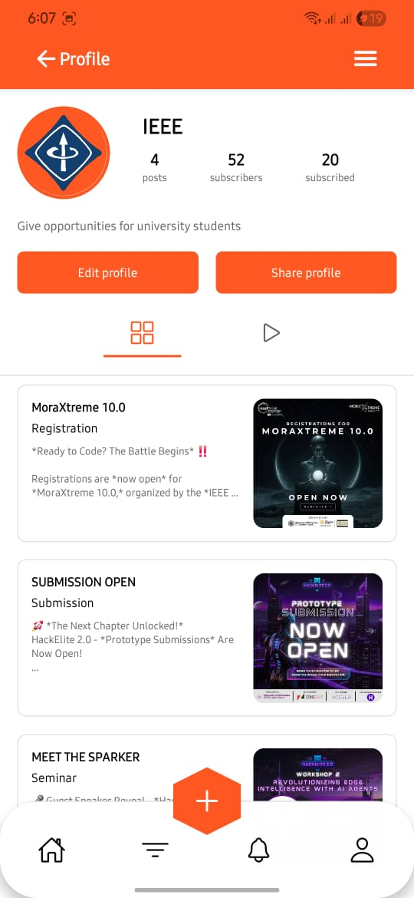</td>
    <td>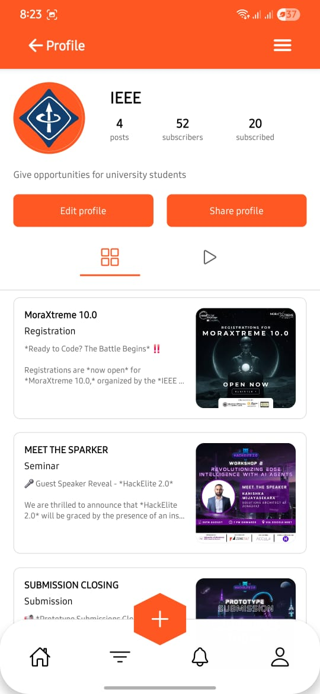</td>
  </tr>
  <tr>
    <td align="center"><b>Category Filter</b></td>
    <td align="center"><b>Admin Panel</b></td>
    <td align="center"><b>Profile Management</b></td>
  </tr>
  <tr>
    <td>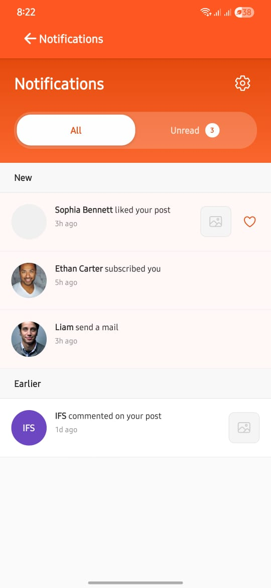</td>
    <td>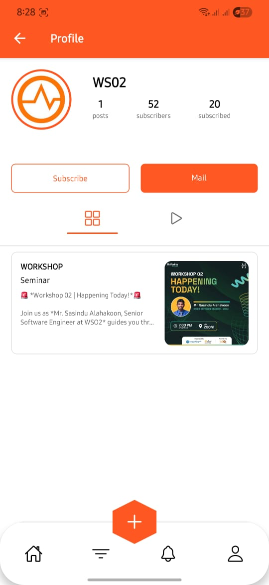</td>
    <td>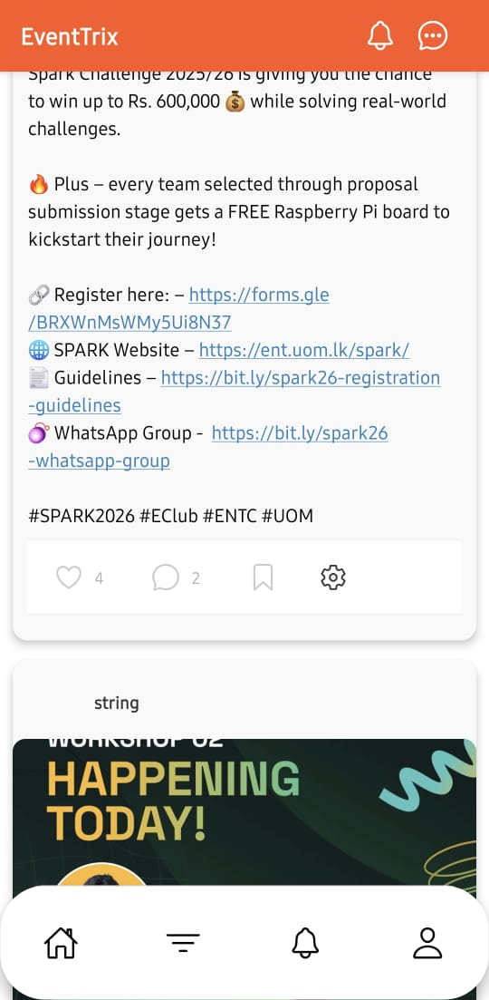</td>
  </tr>
</table>

---

## ✨ Key Features

### 🔐 Authentication & Identity
- Secure registration with **SMTP-based email verification** — no unverified accounts access the platform
- Login protected by **JWT (JSON Web Token)** — stateless, scalable, and industry-standard
- **Role-Based Access Control (RBAC)** — Users, Providers, and Admins have isolated permissions enforced at the API level

### 📰 Personalized News Feed
- IT providers post curated technology news and event updates
- Users **subscribe to specific companies, categories, or topics**
- Content is filterable by **category, date, and popularity**
- Feed is dynamically personalized to each user's active subscriptions

### ⚡ Real-Time Notifications
- **WebSocket integration** (via ASP.NET SignalR Hubs) delivers instant content updates
- Users receive **push notifications** the moment a subscribed source posts
- No polling — pure **event-driven architecture** for minimal latency

### 🛠️ Provider & Admin Tooling
- Providers can create, edit, and delete posts with category tagging
- Admins manage users, content moderation, and platform-wide settings
- Full CRUD operations across all entities via RESTful APIs

### 👤 User Preferences
- Manage notification settings and subscription preferences
- Securely update username and password at any time

---

## 🔒 Security Implementation

Security was treated as a first-class concern throughout the system design — not an afterthought.

### Password Hashing — bcrypt
All user passwords are hashed using **bcrypt** before storage. bcrypt is intentionally slow (work factor configurable), making brute-force and rainbow table attacks computationally infeasible.

```
User Password → bcrypt (salt + hash, cost factor 12) → Stored Hash in MongoDB
Login Attempt → bcrypt.Verify(inputPassword, storedHash) → Access Granted / Denied
```

### JWT Authentication & Token Lifecycle
Authentication uses **signed JWT tokens** — stateless and scalable without server-side sessions.

```
Login Success → JWT Issued (Header.Payload.Signature)
              ↳ Payload: { userId, role, exp (expiration timestamp) }
              ↳ Signed with HMAC-SHA256 secret key (server-side only)

Each API Request → Token extracted from Authorization: Bearer <token>
                 → Signature verified server-side
                 → Expiration (exp) checked — rejected if expired
                 → Role claim checked against endpoint authorization policy
```

**Token Expiration:** Tokens carry a defined TTL (Time-To-Live). Expired tokens are automatically rejected by ASP.NET middleware, forcing re-authentication — minimizing the blast radius of any token compromise.

### Role-Based Access Control (RBAC)
Endpoints are decorated with authorization policies enforced at the controller level. A **User** JWT cannot reach **Provider** or **Admin** routes — the restriction is server-side, not just hidden in the UI.

```csharp
[Authorize(Roles = "Admin")]
[HttpDelete("users/{id}")]
public IActionResult DeleteUser(string id) { ... }

[Authorize(Roles = "Provider,Admin")]
[HttpPost("posts")]
public IActionResult CreatePost([FromBody] PostDto post) { ... }
```

### Email Verification
New accounts remain inactive until the user confirms their email via a **time-sensitive SMTP verification code**. This prevents fake account creation and validates communication channels before granting access.

---

## 🛠️ Tech Stack

| Layer | Technology | Purpose |
|---|---|---|
| Mobile Frontend | React Native + Expo Go | Cross-platform iOS/Android UI |
| HTTP Client | Axios | API communication + request interceptors |
| Backend Framework | ASP.NET (C#) | RESTful API + business logic |
| Real-Time | ASP.NET SignalR (WebSockets) | Live notifications & feed updates |
| Database | MongoDB | Flexible document storage |
| Authentication | JWT (HMAC-SHA256) | Stateless, secure token auth |
| Password Security | bcrypt (cost factor 12) | Adaptive hashing, brute-force resistant |
| Email Service | SMTP | Account verification emails |
| Language | TypeScript (Frontend) / C# (Backend) | Type-safe, production-grade code |

---

## 📁 Project Structure

```
HACKELITE2.0/
├── README.md
├── architecture-eventtrix.svg         # System architecture diagram
├── hackelite.sln
├── Frontend/                          # React Native Mobile App
│   ├── App.tsx                        # Root application component
│   ├── AuthContext.tsx                # Global authentication state (JWT + role)
│   ├── index.ts                       # App entry point
│   ├── app.config.js                  # Expo configuration
│   ├── assets/                        # Images, fonts, icons
│   ├── component/                     # Reusable UI components
│   ├── screens/                       # App screens (Login, Feed, Profile...)
│   ├── services/                      # Axios API service layer
│   ├── styles/                        # Global style definitions
│   ├── utils/                         # Helper functions
│   ├── package.json
│   └── tsconfig.json
└── Backend/                           # ASP.NET Web API
    ├── Program.cs                     # App entry point & middleware config
    ├── Controllers/                   # API route controllers (RBAC enforced)
    ├── Services/                      # Business logic layer
    ├── Models/                        # MongoDB document models
    ├── Hubs/                          # SignalR WebSocket hubs
    ├── Filters/                       # Custom action filters
    ├── Settings/                      # App configuration bindings
    ├── Scripts/                       # Utility scripts
    ├── appsettings.json               # App configuration
    └── Backend.csproj                 # .NET project file
```

---

## 🚀 Getting Started

### Prerequisites

| Tool | Version |
|---|---|
| .NET SDK | 8.0+ |
| Node.js | 18+ |
| MongoDB | 6.0+ (local or Atlas) |
| Expo Go App | Latest (on device) |

### 1. Clone the Repository

```bash
git clone https://github.com/your-username/eventtrix.git
cd HACKELITE2.0
```

### 2. Configure the Backend

```bash
# Update appsettings.local.json with your values
{
  "MongoDB": {
    "ConnectionString": "mongodb://localhost:27017",
    "DatabaseName": "EventTrix"
  },
  "Jwt": {
    "Secret": "your-secret-key-min-32-chars",
    "ExpirationHours": 24
  },
  "Smtp": {
    "Host": "smtp.gmail.com",
    "Port": 587,
    "Username": "your-email@gmail.com",
    "Password": "your-app-password"
  }
}
```

### 3. Run the Backend API

```bash
cd Backend
dotnet restore
dotnet run
```

> ✅ Backend runs at: `https://localhost:5179`
> Ensure MongoDB is running and connected before starting.

### 4. Configure & Run the Mobile App

```bash
cd Frontend
npm install

# Update .env with your backend URL
EXPO_PUBLIC_API_URL=https://your-local-ip:5179
```

```bash
expo start
```

> 📱 Scan the QR code with **Expo Go** on your Android or iOS device.
> Ensure your mobile device and development machine are on the same network.

---

## 📡 API Reference

| Method | Endpoint | Role | Description |
|---|---|---|---|
| `POST` | `/api/auth/register` | Public | Register new account |
| `POST` | `/api/auth/login` | Public | Login, receive JWT |
| `POST` | `/api/auth/verify` | Public | Email verification |
| `GET` | `/api/posts` | User | Get personalized feed |
| `POST` | `/api/posts` | Provider | Create a new post |
| `PUT` | `/api/posts/{id}` | Provider | Update post |
| `DELETE` | `/api/posts/{id}` | Provider / Admin | Delete post |
| `POST` | `/api/subscriptions` | User | Subscribe to topic/company |
| `DELETE` | `/api/subscriptions/{id}` | User | Unsubscribe |
| `GET` | `/api/admin/users` | Admin | List all users |
| `DELETE` | `/api/admin/users/{id}` | Admin | Remove a user |

All protected endpoints require: `Authorization: Bearer <JWT_TOKEN>`

---

## 💡 What I Learned

Building EventTrix under hackathon pressure reinforced several engineering fundamentals:

- **Designing for real-time at scale** — WebSockets require a different mental model than REST; managing connection state, reconnection logic, and event broadcasting across subscriber groups was a deep learning curve
- **Security-by-default mindset** — Implementing RBAC, token expiration, and bcrypt from day one rather than retrofitting security as a post-build concern
- **Mobile-backend contract design** — Defining clear API contracts (types, error codes, response shapes) between the React Native client and ASP.NET backend prevented integration bugs late in the build cycle
- **Expo Go limitations** — Navigating Expo's managed workflow constraints (native modules, push notification configs) taught pragmatic problem-solving under time pressure
- **System architecture thinking** — Designing and documenting a layered architecture diagram before writing code clarified responsibilities between components and reduced rework
- **Team velocity under pressure** — Coordinating frontend and backend work streams simultaneously using Git branching and clear interface contracts kept the team moving without blocking each other

---

## 👨‍💻 Built By

Developed for **IEEE HackElite 2.0 — 2025**
A nationally competitive IEEE hackathon focused on innovative software solutions.

> *"Top 5 Finalist — Full-stack system built from scratch under hackathon conditions."*

---

<div align="center">

**If this project impressed you, feel free to ⭐ star the repo and connect!**

[](https://github.com/Tishanth-07)
[](https://www.linkedin.com/in/tishanth-t007/)

</div>